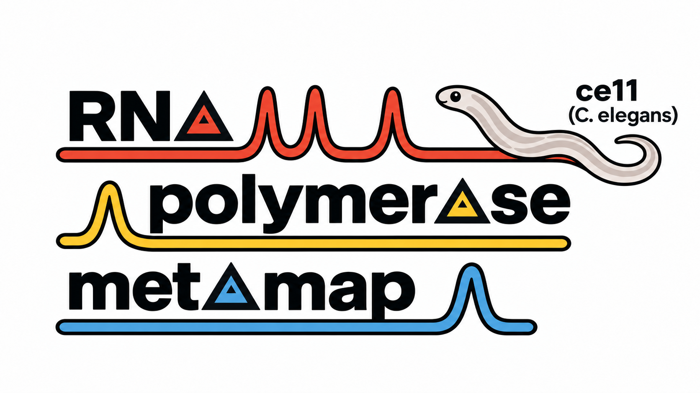

# Overview:

We applied a uniform, context-agnostic framework for scoring RNA polymerase (Pol) I, II, and III occupancies using ChIP-seq experiments performed in worm (C. elegans), facilitating unbiased annotation of polymerase occupancy and overlap. 

[](https://igv.org/app/?sessionURL=blob:xVVta9swEP4rRZ82yCQnfU2.NWErga4rKStjIwTZuspispRKct029L_vZDsv_eRsdNRgy9LdPXfPY1m3Ig_gvLKGjMghPaNnpEd8bqsbXiw1XPECPBndce2hRxzcgQOTARmtiBIYkUG_jwEG3XA2oQegQXLjDz5Ey0c0hcqOVfg.u0R7HsLSjxjLpbCV0ZYL6i3QMvMZBVEyabUAc81DzmI4S5X8qZa.ntBBqgLiVbnVcAHGFnCroCKj4EosLXsKNuVG_FsiwQNPuQcWYcYIMxVgaXgMVD5jTq4V929AIcudLc4jWMRG4HrBeuTyzQlwZPQrLk0by3Qzrl9um7EdfpB5i3CjnuHN6qM.omGKvEx9rGgNqeQDtU4yWYvvWbQ3IPjWEupKX8dcTL6wJEnwHrDh2XGcL5J4DXBGTzZw85ce0TYrsQr8BBrhnVVYEdIOjme_Y3UrEp6Wce95uC_rrdkjttHy0zBJTvvD4eD46PQoGQ77L70VKZ3eUUmqEJNltmC33IytCxouecpmV.dLq58KcLgpFgUEXvDlYvK52dzM8Yrhv4ASABeeFVwZdm31oH6gu1DcLDJbmuAXxroC988zCJpW219lD887pWF_75b0IcZFS8Ao_LaVkvEfbCSKk_.twWH92FuDLs_XGnR5txocvacGU3kR7_0U6HbcEaDbueV__J78v5Y6qInm3l_Hsy2AW7vTFMSWeqffDvNO35b4yS7x2tCy5sbYwEPscnhGgZI5upwmUYi6jUUScD8pHQ.7Nc7q5YPt.mvV_rq7mCxViHmzSbVtMcoIeMQc61a74YGl4YEL9dla7GavqopGQGp0QY3KqbQPrCHSDguP3TgLbCtQvz5mO2WZv_wB-)  
*Middle-click or Cmd/Ctrl + click badge to open in a new tab*

The composite tracks are truncated at 3 normalized counts to accommodate GitHub's maximum file-size limit. Score tracks are truncated at 0.25.

